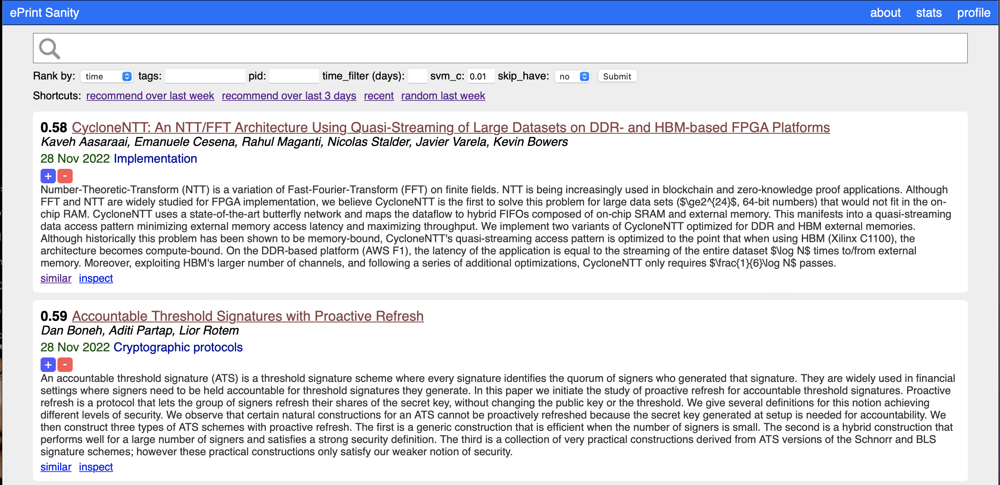

# [ePrint Sanity](eprint-sanity.com)

ePrint Sanity is a web interface that attempts to tame the overwhelming flood of papers on IACR Cryptology ePrint Archive. It allows researchers to keep track of recent papers, search for papers, sort papers by similarity to any paper, see recent popular papers, to add papers to a personal library, and to get personalized recommendations of (new or old) ePrint papers. This is a fork of [@karpathy](https://twitter.com/karpathy)'s [ePrint Sanity](https://arxiv-sanity-lite.com).

I am running a live version of this code on [eprint-sanity.com](eprint-sanity.com).



#### To run

To run, use `make fun` periodically and `make up` to host the server.

#### Requirements

 Install via requirements, recommend a venv:

 ```bash
 pip install -r requirements.txt
 ```

#### Todos

- Make website mobile friendly with media queries in css etc
- The metas table should not be a sqlitedict but a proper sqlite table, for efficiency
- Build a reverse index to support faster search, right now we iterate through the entire database

#### License

MIT
